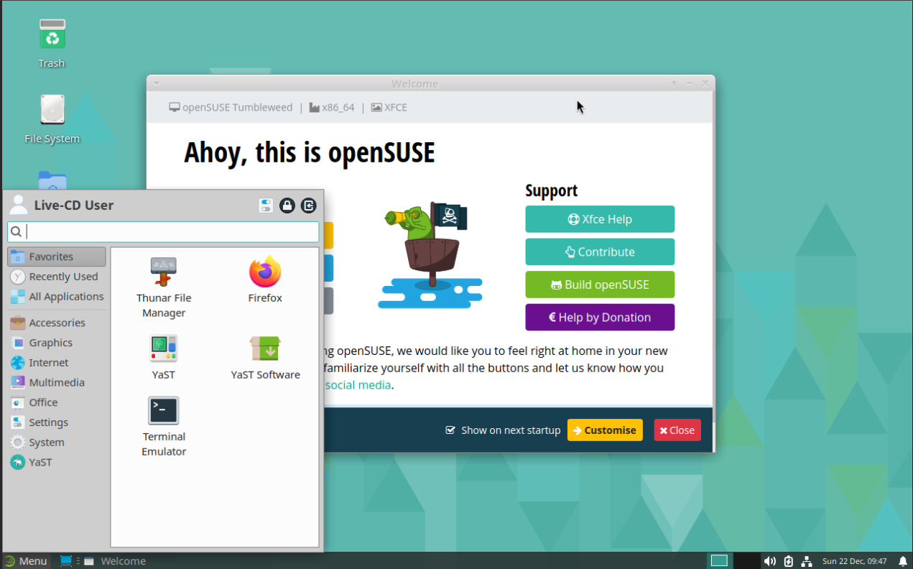
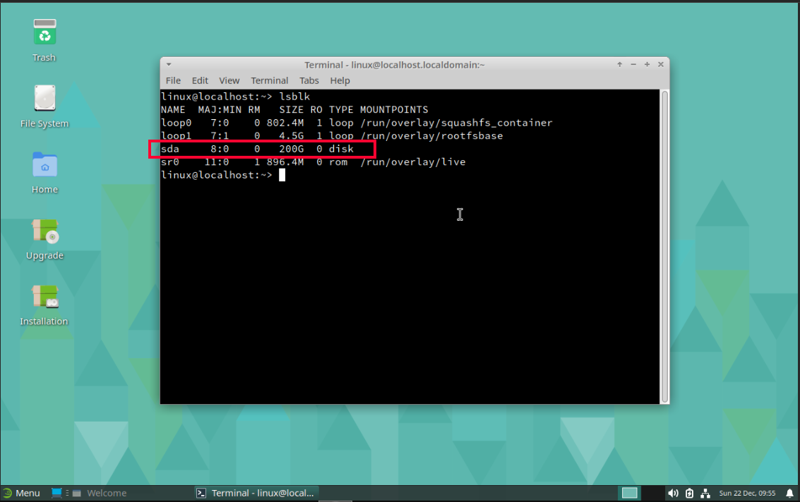
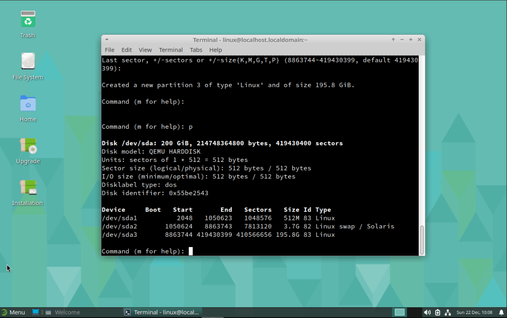
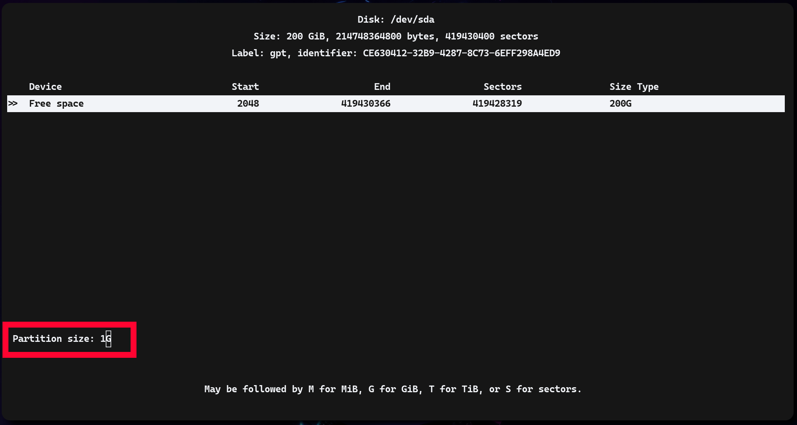
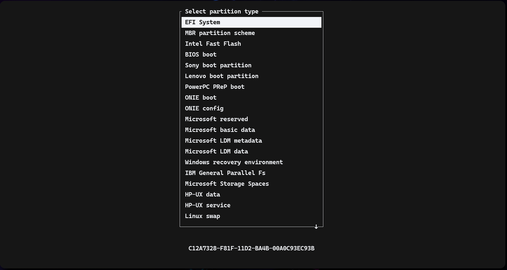
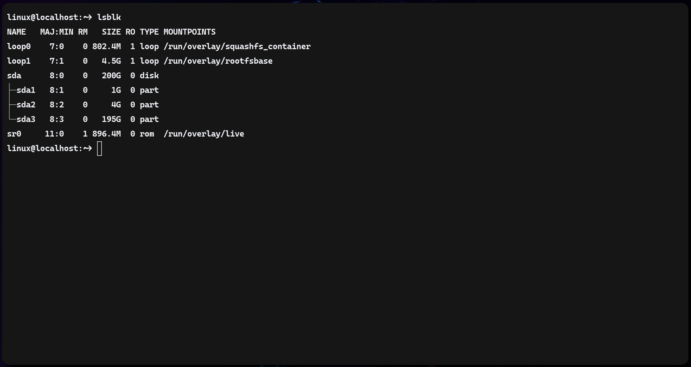
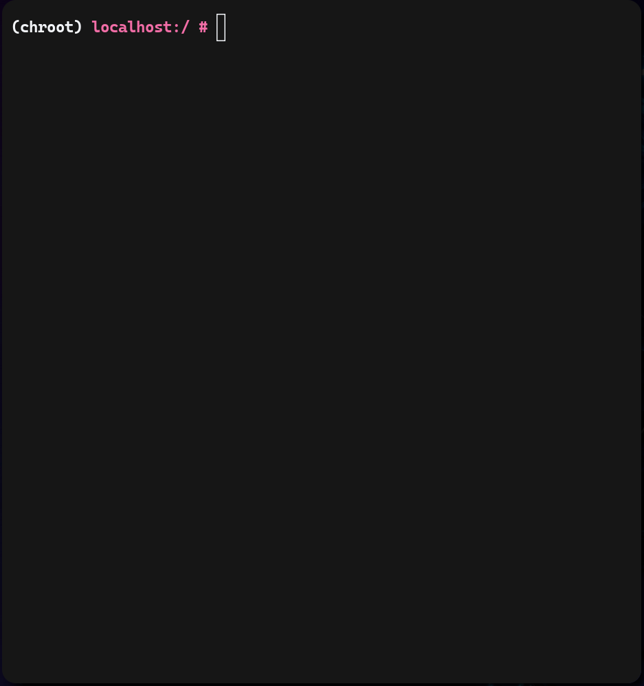

# Установка OpenSuse Tumbleweed

## Создание загрузочного USB накопителя

### Установка Live CD образа

```sh
wget https://download.opensuse.org/tumbleweed/iso/openSUSE-Tumbleweed-XFCE-Live-x86_64-Current.iso
```

!!!
Я буду ставить OpenSuse без установщика, то есть через консоль.
!!!

### Сжение(Burn) ISO образа

```sh
sudo dd bs=4M if=/path/to/iso of=/dev/sdX && sync
```

## Процесс установки

### Запуск Live CD

Как и с любой другой операционной системой или дистрибутивом Linux,
мы должны войти в загрузочный образ ISO.

После того как мы это сделаем перед нами появится XFCE рабочий стол.



После этого требуется лишь открыть браузер с этим руководством и терминал.

### (Опционально) Настройка SSH для доступа к системе

```sh
sudo passwd linux
sudo systemctl start sshd
```

Далее просто используем `ssh linux@x.x.x.x`.

### Обновление Live CD

Я считаю необходимым обновить весь инструментарий Live CD до последних версий.

```sh
sudo zypper refresh
sudo zypper update
```

### Установка локалей

Без настройки локалей будет возникать ряд ошибок во время установки.

```sh
sudo zypper install glibc-locale glibc-i18ndata glibc-gconv-modules-extra
sudo localedef -i en_US -f UTF-8 en_US.UTF-8
```

### Подготовка разделов на жестком диске

Для начала требуется узнать наименование необходимого жесткого диска.
Делается это при помощи команды `lsblk`.



Далее при помощи утилиты `cfdisk` необходимо настроить разделы на данном диске.

```sh
sudo cfdisk /dev/sda
```

Нам предложат выбрать тип системы, для UEFI выбираем `gpt`.



После чего создаем новый раздел и вводим количество необходимой памяти.



А также меняем тип раздела при необходимости.



!!!
Нам нужно три раздела:
1. 1G - EFI Filesystem
2. 4G - Linux swap
3. +100% - Linux filesystem
!!!

Далее выбираем `Write` подтверждаем создание разделов и выходим.

Теперь при помощи все той же команды `lsblk`,
мы можем увидеть, что разделы успешно создались.



### Форматирование разделов

#### ext4

```sh
sudo mkfs.vfat -n EFI /dev/sda1
sudo mkfs.ext4 -L root /dev/sda3
sudo mkswap -L swap /dev/sda2
sudo swapon /dev/sda2
```

#### btrfs

```sh
sudo mkfs.vfat -n EFI /dev/sda1
sudo mkfs.btrfs -L root /dev/sda2
sudo mkswap -L swap /dev/sda2
sudo swapon /dev/sda2
```

### Монтирование разделов

#### ext4 

```sh
# Монтирование основных разделов
sudo mkdir -p /mnt/os
sudo mount /dev/sda3 /mnt/os
sudo mkdir -p /mnt/os/boot/efi
sudo mount /dev/sda1 /mnt/os/boot/efi

# Необходимый для операционной системы шлак
sudo mkdir /mnt/os/{proc,sys,dev,run}
sudo mount --types proc /proc /mnt/os/proc
sudo mount --rbind /sys /mnt/os/sys
sudo mount --make-rslave /mnt/os/sys
sudo mount --rbind /dev /mnt/os/dev
sudo mount --make-rslave /mnt/os/dev
sudo mount --bind /run /mnt/os/run
sudo mount --make-slave /mnt/os/run
```

#### btrfs

Сначала надо создать все необходимые разделы.

```sh
sudo mkdir -p /mnt/os
sudo mount /dev/sda3 /mnt/os
sudo btrfs subvolume create /mnt/os/@
sudo btrfs subvolume create /mnt/os/@/.snapshots
sudo mkdir /mnt/os/@/.snapshots/1
sudo btrfs subvolume create /mnt/os/@/.snapshots/1/snapshot
sudo mkdir -p /mnt/os/@/boot/grub2/
sudo btrfs subvolume create /mnt/os/@/boot/grub2/i386-pc
sudo btrfs subvolume create /mnt/os/@/boot/grub2/x86_64-efi
sudo btrfs subvolume create /mnt/os/@/home
sudo btrfs subvolume create /mnt/os/@/opt
sudo btrfs subvolume create /mnt/os/@/root
sudo btrfs subvolume create /mnt/os/@/srv
sudo btrfs subvolume create /mnt/os/@/tmp
sudo mkdir /mnt/os/@/usr/
sudo btrfs subvolume create /mnt/os/@/usr/local
sudo btrfs subvolume create /mnt/os/@/var
```

Затем для btrfs отключить функционал `Copy-On-Write`.
Чтобы улучшить производительность для VM и баз данных.

```sh
sudo chattr +C /mnt/os/@/var
```

Далее необходимо создать конфигурацию для *snapper*.
Вместо *$DATE* поставьте текущую дату и время. Например: `2025-01-05T15:30:00`.

```xml
<!--/mnt/os/@/.snapshots/1/info.xml-->
<?xml version="1.0"?>
<snapshot>
  <type>single</type>
  <num>1</num>
  <date>$DATE</date>
  <description>first root filesystem</description>
</snapshot>
```

Устанавливаем этот снимок системы по-умолчанию для файловой системы root.

```sh
sudo btrfs subvolume set-default $(btrfs subvolume list /mnt/os | grep "@/.snapshots/1/snapshot" | grep -oP '(?<=ID )[0-9]+') /mnt/os
sudo umount /mnt/os
sudo mount /dev/sda3 /mnt/os
```

Далее создает нужные директории.

```sh
sudo mkdir /mnt/os/.snapshots
sudo mkdir -p /mnt/os/boot/grub2/i386-pc
sudo mkdir -p /mnt/os/boot/grub2/x86_64-efi
sudo mkdir /mnt/os/home
sudo mkdir /mnt/os/opt
sudo mkdir /mnt/os/root
sudo mkdir /mnt/os/srv
sudo mkdir /mnt/os/tmp
sudo mkdir -p /mnt/os/usr/local
sudo mkdir /mnt/os/var
```

И теперь наконец-то монтирование системы.

```sh
sudo mount /dev/sda1 /mnt/os/.snapshots -o subvol=@/.snapshots
sudo mount /dev/sda1 /mnt/os/boot/grub2/i386-pc -o subvol=@/boot/grub2/i386-pc
sudo mount /dev/sda1 /mnt/os/boot/grub2/x86_64-efi -o subvol=@/boot/grub2/x86_64-efi
sudo mount /dev/sda1 /mnt/os/home -o subvol=@/home
sudo mount /dev/sda1 /mnt/os/opt -o subvol=@/opt
sudo mount /dev/sda1 /mnt/os/root -o subvol=@/root
sudo mount /dev/sda1 /mnt/os/srv -o subvol=@/srv
sudo mount /dev/sda1 /mnt/os/tmp -o subvol=@/tmp
sudo mount /dev/sda1 /mnt/os/usr/local -o subvol=@/usr/local
sudo mount /dev/sda1 /mnt/os/var -o subvol=@/var
sudo mkdir -p /mnt/os/boot/efi
sudo mount /dev/sda1 /mnt/os/boot/efi

# Необходимый для операционной системы шлак
sudo mkdir /mnt/os/{proc,sys,dev,run}
sudo mount --types proc /proc /mnt/os/proc
sudo mount --rbind /sys /mnt/os/sys
sudo mount --make-rslave /mnt/os/sys
sudo mount --rbind /dev /mnt/os/dev
sudo mount --make-rslave /mnt/os/dev
sudo mount --bind /run /mnt/os/run
sudo mount --make-slave /mnt/os/run
```

### Установка базовой системы

```sh
sudo zypper --root /mnt/os ar --refresh https://download.opensuse.org/tumbleweed/repo/oss/ oss
sudo zypper --root /mnt/os in kernel-default grub2-x86_64-efi zypper bash man vim shadow util-linux
sudo zypper --root /mnt/os in --no-recommends NetworkManager
```

Для btrfs также:

```sh
sudo zypper --root /mnt/os in grub2-snapper-plugin btrfsprogs
```

### Chrooting

```sh
sudo chroot /mnt/os /bin/bash
source /etc/profile
export PS1="(chroot) ${PS1}"
```

После чего перед нами будет терминал следующего вида.



### Настройка fstab

Для начала нам надо получить UUID всех трех разделов.

```sh
echo "$(blkid)" >> /etc/fstab
```

После чего мы открываем файл `/etc/fstab` и редактируем его по примеру ниже.
Не забывая вставлять нужные UUID.

Для *ext4*:

```sh
UUID=[...]   /boot/efi      vfat    defaults,noatime     0 2
UUID=[...]   none           swap    sw                   0 0
UUID=[...]   /              ext4    noatime              0 1
```

Для *btrfs subvolumes*:

```sh
UUID=[UUID_EFI]   /boot/efi      vfat    defaults,noatime     0 2
UUID=[UUID_SMAP]  none           swap    sw                   0 0
UUID=[UUID_BTRFS] /              btrfs   subvol=@,compress=zstd,noatime    0 1
UUID=[UUID_BTRFS] /.snapshots    btrfs   subvol=@/.snapshots,noatime       0 2
UUID=[UUID_BTRFS] /home          btrfs   subvol=@/home,compress=zstd,noatime 0 2
UUID=[UUID_BTRFS] /opt           btrfs   subvol=@/opt,compress=zstd,noatime  0 2
UUID=[UUID_BTRFS] /root          btrfs   subvol=@/root,compress=zstd,noatime 0 2
UUID=[UUID_BTRFS] /srv           btrfs   subvol=@/srv,compress=zstd,noatime  0 2
UUID=[UUID_BTRFS] /tmp           btrfs   subvol=@/tmp,noatime              0 2
UUID=[UUID_BTRFS] /usr/local     btrfs   subvol=@/usr/local,compress=zstd,noatime 0 2
UUID=[UUID_BTRFS] /var           btrfs   subvol=@/var,noatime
```

### Установка grub

```sh
dracut -f
grub2-install --efi-directory=/boot/efi --target=x86_64-efi --bootloader-id=opensuse
grub2-mkconfig -o /boot/grub2/grub.cfg
passwd
```

### Загрузка в систему

```sh
exit
umount -l /mnt/os/dev/{/shm,/pts,}
umount -R /mnt/os
reboot
sudo systemctl enable --now NetworkManager
```
